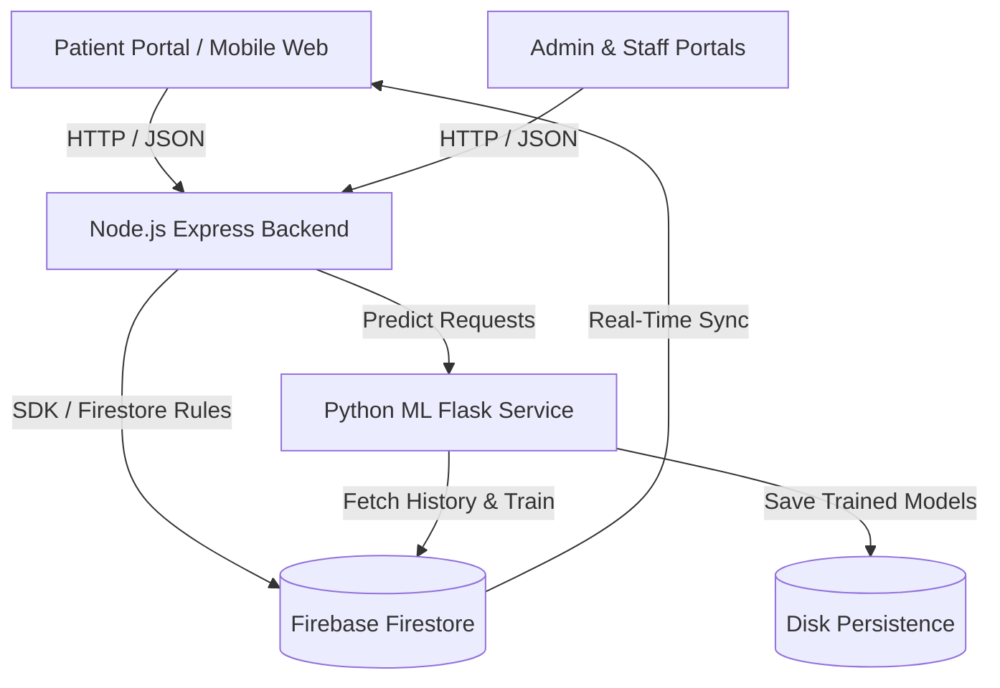

# SmartClinic — Premium Full-Stack Clinic & Queue Management Platform

[](https://codecov.io/gh/khavi22/smartClinic)

SmartClinic is a state-of-the-art, full-stack clinic management and smart appointment booking application designed to streamline healthcare access. By pairing a robust Node.js backend with an advanced Python Machine Learning wait-time prediction service, SmartClinic enables patients to find local clinics, check live queues, book dynamic appointments, and view real-time, ML-predicted wait times. Simultaneously, it provides clinic admins and medical staff with powerful service, queue triage, and analytical reporting dashboards.

---

## Core Pillars & Features



### 1. Patient Portal
*   **Intelligent Clinic Discovery**: Multi-filter clinic search covering Province, District, Region, and Address coordinates.
*   **Dynamic Appointment Engine**: Fully dynamic, Firebase-backed availability engine that prevents double-booking and updates calendars in real-time.
*   **One-Click Context Rescheduling**: Interactive, state-aware calendar allowing patients to seamlessly reschedule appointments while preserving user history and minimizing workflow friction.
*   **Live Queue Monitor**: Dedicated live patient queue display allowing remote check-ins and progress tracking.
*   **Authentication & Profile**: Integrated Firebase client auth supporting secure Patient login, registration, and personal dashboard management.

### 2. Clinic Administration
*   **Google Places Onboarding**: Multi-step onboarding system capturing clinic operational metadata, administrative codes, and address geolocation.
*   **Service & Catalog Builder**: Custom service catalogs enabling admins to configure clinic-specific consultations (e.g., General, Dental, Vaccination, Chronic, Mental Health) and assign base durations.
*   **Dynamic Operations Schedule**: Precision hour configurations allowing clinics to lock in custom opening, closing, and lunch intervals.
*   **Staff Registry & Approvals**: System to manage staff invitation codes, approve incoming medical profiles, and handle permissions.

### 3. Medical Staff & Triage
*   **Patient Triage Dashboard**: Active list allowing doctors to check patients in, adjust priority levels, and trigger live consulting states.
*   **Consultation Queue Controller**: Transitions patients from `WAITING` to `IN_CONSULTATION` and automatically tallies consulting durations upon completion.
*   **TV Queue Board**: Dedicated aesthetic waiting-room display showing queue slots, active treatments, and estimated time to be called.

### 4. Workload & Analytics Reports
*   **Clinic Load Forecasts**: Hourly busyness and load tracking across dates.
*   **Wait-Time Metrics**: Deep analytics showing average actual wait times vs. predicted estimations.
*   **No-Show Analysis**: Missed-appointment metrics, percentage of unfulfilled bookings, and actionable clinic productivity logs.
*   **Staff Workload Summary**: Total patients consulted, consult duration distributions, and efficiency tracking.

---

## Python Machine Learning Service (ml_service)

The ML service is a self-contained Python Flask application dedicated to wait-time and clinic busyness prediction. It utilizes historical Firestore data to train and serve predictive regression models, incorporating advanced feature engineering and real-time state hybridization.

### 1. Dual-Regression Model Architecture
*   **Busyness Model (GradientBoostingRegressor)**:
    *   **Goal**: Predict the expected appointment volume for a specific clinic at any given hour.
    *   **Features**: `clinic_code`, `day_of_week`, `hour`, `day_sin`, `day_cos`, `hour_sin`, `hour_cos`, `is_morning`, `is_afternoon`, `is_weekend`.
*   **Consultation Duration Model (GradientBoostingRegressor)**:
    *   **Goal**: Predict the precise duration (in minutes) for a patient's consultation based on case history.
    *   **Features**: `clinic_code`, `service_code`, `day_of_week`, `hour`, `priority` (Triage level), cyclic time mappings, and operational indicators.

### 2. Cyclic Time-Series Feature Engineering
To capture periodic weekly and daily human behavior patterns (e.g., morning check-in spikes, weekend slowdowns), time values are mapped using sine and cosine transformations:
$$\text{day\_sin} = \sin\left(\frac{2\pi \cdot \text{day\_of\_week}}{7}\right) \quad \text{day\_cos} = \cos\left(\frac{2\pi \cdot \text{day\_of\_week}}{7}\right)$$
$$\text{hour\_sin} = \sin\left(\frac{2\pi \cdot \text{hour}}{24}\right) \quad \text{hour\_cos} = \cos\left(\frac{2\pi \cdot \text{hour}}{24}\right)$$

### 3. Smart State Hybridization
*   **Future Dates**: Relies entirely on the ML Busyness & Duration models to estimate typical queues and consultation overhead.
*   **Same-Day Predictions**: Dynamically queries the **live Firestore Queue** for the target clinic. It aggregates the remaining estimated time of patients already `IN_CONSULTATION` (subtracting elapsed minutes) plus the predicted consultation duration of all `WAITING` patients ahead in the queue.

### 4. Background Continuous Learning
Upon startup, the ML service searches for persisted serialization files (`models/*.pkl`, `models/mappings.json`) to warm up immediately. A daemon background thread triggers retraining every hour (`3600` seconds) to pull new logs from Firestore, keeping estimations precise.

---

## Comprehensive Project Directory Structure

```text
smartClinic/
├── Controllers/                  # Backend Express Controllers
│   ├── AdminController.js        # Admin actions (operational hours, staff lists)
│   ├── AdminOnboardingController.js # Multi-step Google Place onboarding
│   ├── ClinicsController.js      # Public discovery and details retrieval
│   ├── SetAvailabilityController.js # Managing custom clinic time configurations
│   ├── UserController.js         # Patient sign-in, profile mapping, and metadata
│   ├── appointmentsController.js # Book, reschedule, cancel, and slot allocations
│   ├── patientQueueController.js # Live patient-side check-ins and queue registration
│   └── queueController.js        # Doctor triage, active consultation states, queue completion
├── models/                       # Data Model Class Definitions
│   └── appointment.js            # Standard structure for appointment records
├── services/                     # Core Backend Services
│   ├── config/
│   │   └── firebase.js           # Shared Firebase Admin & Firestore DB setup
│   ├── clinicService.js          # Direct Firestore CRUD operations for clinic metadata
│   ├── emailService.js           # Nodemailer integration for booking confirmations
│   ├── firebaseService.js        # Root Firebase helpers (user profiles, custom claims)
│   ├── patientQueueService.js    # Direct queue updates and active check-in tracking
│   ├── queueService.js           # Live queue lists, status changes, consult times
│   └── SetAvailabilityService.js # Compiles open booking windows based on hours
├── ml_service/                   # Python Machine Learning Microservice
│   ├── app.py                    # Flask server endpoints, modeling pipelines, training thread
│   ├── mock_data.py              # Synthetic telemetry and clinic seed-data generators
│   ├── requirements.txt          # Python dependency checklist (Flask, scikit-learn, etc.)
│   └── serviceAccountKey.json    # Local Firebase certificate (git-ignored in production)
├── public/                       # Aesthetic Glassmorphic Frontend Assets
│   ├── css/                      # Responsive CSS Styling systems
│   ├── js/                       # Interactive Frontend Javascript modules
│   │   ├── availability.js       # Dynamic scheduling calendar, wait estimations, and slot booking
│   │   ├── adminDashboard.js     # Administrative charts, schedules, and approvals
│   │   ├── staffReport.js        # Analytical reporting tables and KPIs
│   │   └── queue.js              # Triage controller and live TV waiting board
│   ├── index.html                # Platform Welcome Page
│   ├── login.html                # Secure Patient Login
│   ├── signUp.html               # Patient Signup Page
│   ├── dashboard.html            # Patient Profile & Appointment Actions
│   ├── Availability.html         # Booking Calendar interface
│   ├── patientQueue.html         # Real-time Patient Queue Tracker
│   ├── staffDashboard.html       # Medical Triage interface
│   ├── queue.html                # Waiting room monitor
│   ├── waitTimesReport.html      # Wait times analytical view
│   ├── Staffreport.html          # Productivity reports
│   └── noShowReport.html         # Attendance analytical graphs
├── routes/                       # Express Router Endpoint Definitions
│   ├── admin.js                  # Staff details, invite approvals
│   ├── AdminOnboarding.js        # Clinic profile creation
│   ├── appointments.js           # Booking allocations and rescheduling
│   ├── clinics.js                # Clinic discovery and hours
│   ├── patientQueueRoutes.js     # Live check-ins
│   ├── queue.js                  # Doctor consult status transitions
│   ├── StaffAvailability.js      # Availability updates
│   └── user.js                   # Patient profile endpoints
├── scripts/                      # Developer Telemetry & Database Seed Tools
│   ├── migrateUsers.js           # Standardizes patient profiles & sets Firebase custom claims
│   ├── migrateStaffApproval.js   # Initializes authorization keys for staff
│   ├── onboardClinic.js          # Geolocation setup and base clinic seeder
│   ├── seedServiceTemplates.js   # Populates service metadata (General, Dental, etc.)
│   ├── seedMockQueue.js          # Populates mock completed visits for ML training
│   └── flood_clinic.js           # Stress-tests clinic capacity logs
├── tests/                        # Exhaustive Jest Test Suites
│   ├── UserController.test.js    # Auth state mapping tests
│   ├── clinicsController.test.js # Discovery and validation testing
│   ├── queueController.test.js   # Triage workflows, prioritization, and completion states
│   └── ...                       # Extensive unit tests targeting backend services
├── firestore.rules               # Deep role-based Firebase Security Rules
├── firebase.json                 # Firebase Hosting & Functions config
├── package.json                  # Node.js dependencies, scripts, and Jest settings
└── server.js                     # Root Node.js Express server entry point
```

---

## Firebase Security Rules

SmartClinic implements strict, granular Firestore security rules in `firestore.rules` to guarantee data privacy and role separation:

*   **Helper Utilities**:
    *   `signedIn()`: Requires a valid Firebase Auth token.
    *   `isOwner(uid)`: Verifies that the authenticated user matches the document identifier.
    *   `isSupportTeam()`: Limits highly sensitive administrative tools to curated, verified developer emails.
*   **Security Schema**:
    *   `/patients/{uid}`: Only accessible (read/write) by the patient owner.
    *   `/admins/{uid}` & `/staff/{uid}`: Authenticated users can read their profiles; all write operations are handled by the secure backend Admin SDK to prevent self-elevation.
    *   `/clinics/{clinicId}`: Publicly readable. Only the specific owning clinic admin can update metadata fields, explicitly blocklisting immutable properties (e.g., Google `placeId`, `adminCode`, `isActive`, address fields).
    *   `/appointments/{appointmentId}`: Only accessible by the patient who booked it, the clinic admin, or approved medical staff. Patients can create/reschedule their own slots.
    *   `/adminInvitations/{invitationId}`: Strictly restricted to the central support team.

---

## Getting Started & Local Setup

### 1. Prerequisites
*   **Node.js**: v18.x or higher recommended.
*   **Python**: v3.10.x or higher recommended.
*   **Firebase Project**: An active Firestore database with Firebase Authentication configured.

### 2. Node.js Backend Setup
1.  Clone the repository:
    ```bash
    git clone https://github.com/khavi22/smartClinic.git
    cd smartClinic
    ```
2.  Install packages:
    ```bash
    npm install
    ```
3.  Configure `.env` in the root:
    ```ini
    PORT=3000
    NODE_ENV=development
    ML_SERVICE_URL=http://localhost:5001
    FIREBASE_CREDENTIALS_JSON={"type": "service_account", "project_id": "...", ...}
    ```

### 3. Python ML Service Setup
1.  Navigate to the `ml_service` directory:
    ```bash
    cd ml_service
    ```
2.  Create and activate a virtual environment:
    ```bash
    python -m venv venv
    # Windows:
    .\venv\Scripts\activate
    # macOS/Linux:
    source venv/bin/activate
    ```
3.  Install libraries:
    ```bash
    pip install -r requirements.txt
    ```
4.  Configure `.env` inside the `ml_service` folder (optional, falls back to `serviceAccountKey.json` if absent):
    ```ini
    FIREBASE_CREDENTIALS_JSON={"type": "service_account", ...}
    ```

---

## Seeding Data & Simulating Telemetry

SmartClinic includes several scripts to seed your Firestore instance with mock metadata, patient records, and past queues. This provides a functional local interface and satisfies the minimum sample requirements (MIN_QUEUE_SAMPLES = 20) to train the ML models.

Run the following commands in the root of the project:

1.  **Seed Clinic Service Templates**:
    ```bash
    node scripts/seedServiceTemplates.js
    ```
2.  **Migrate Patient Profiles & Claims**:
    ```bash
    node scripts/migrateUsers.js
    ```
3.  **Seed Mock Queue & Consultation History**:
    Populates historical completed consultation records to train the wait-time model:
    ```bash
    node scripts/seedMockQueue.js
    ```
4.  **Simulate Real-time Capacity / Flood Logs**:
    ```bash
    node scripts/flood_clinic.js
    ```

---

## Running the Platform

To run the full stack locally, launch both servers concurrently:

### Run Express Backend
```bash
# From root directory
npm start
```
*   Backend URL: `http://localhost:3000`

### Run Python ML Backend
```bash
# From ml_service directory with venv active
python app.py
```
*   ML Service URL: `http://localhost:5001`
*   Verify model readiness: `http://localhost:5001/health`

---

## Jest Test Suite & Code Quality

SmartClinic utilizes Jest and Supertest for unit, integration, and flow verification. Code coverage is configured with a strict **80% quality threshold** across Branches, Functions, Lines, and Statements.

### Run All Tests
```bash
npm test
```

### Run Tests with Coverage Reports
```bash
npm run coverage
```
The detailed coverage reports will be rendered into the `./coverage` directory, ensuring all controller routes and database services meet production standards.

---

## Production Deployment Guide

Deploying SmartClinic involves hosting the Node.js Express server and the Python Flask ML service separately, then linking them via environment variables.

### 1. Python ML Service (ml_service)
The Flask service can be hosted on cloud platform providers such as **Render.com** or **Railway.app**.

#### Option A: Render.com
1.  Fork the SmartClinic repository to your GitHub account.
2.  On Render, create a **New Web Service** and select your forked repository.
3.  Use the following configuration:
    *   **Root Directory**: `ml_service`
    *   **Build Command**: `pip install -r requirements.txt`
    *   **Start Command**: `gunicorn app:app`
    *   **Instance Type**: Free tier
4.  Add the following **Environment Variable**:
    *   **Key**: `FIREBASE_CREDENTIALS_JSON`
    *   **Value**: *Paste the entire JSON text from your `serviceAccountKey.json`*
5.  Deploy and copy the generated service URL (e.g., `https://smartclinic-ml.onrender.com`).

#### Option B: Railway.app (Direct Terminal Deploy)
1.  Install the Railway CLI: `npm i -g @railway/cli`
2.  In the `ml_service` folder, run:
    ```bash
    railway login
    railway init
    railway up
    ```
3.  Add the `FIREBASE_CREDENTIALS_JSON` env variable inside the Railway dashboard.

### 2. Node.js Express Backend
1.  Deploy the root Express code to your preferred host (Firebase App Hosting, Render, Heroku, or Azure).
2.  Add the following **Environment Variables** in the host settings:
    *   `ML_SERVICE_URL`: *The URL of your deployed Python ML service (from Step 1).*
    *   `FIREBASE_CREDENTIALS_JSON`: *Your Firebase credential JSON string.*
3.  Start the service. The Express app will now direct wait-time checks and retraining triggers to the production ML pipeline automatically.

---
*Developed by the SmartClinic Team. Built for speed, accessibility, and precision.*
