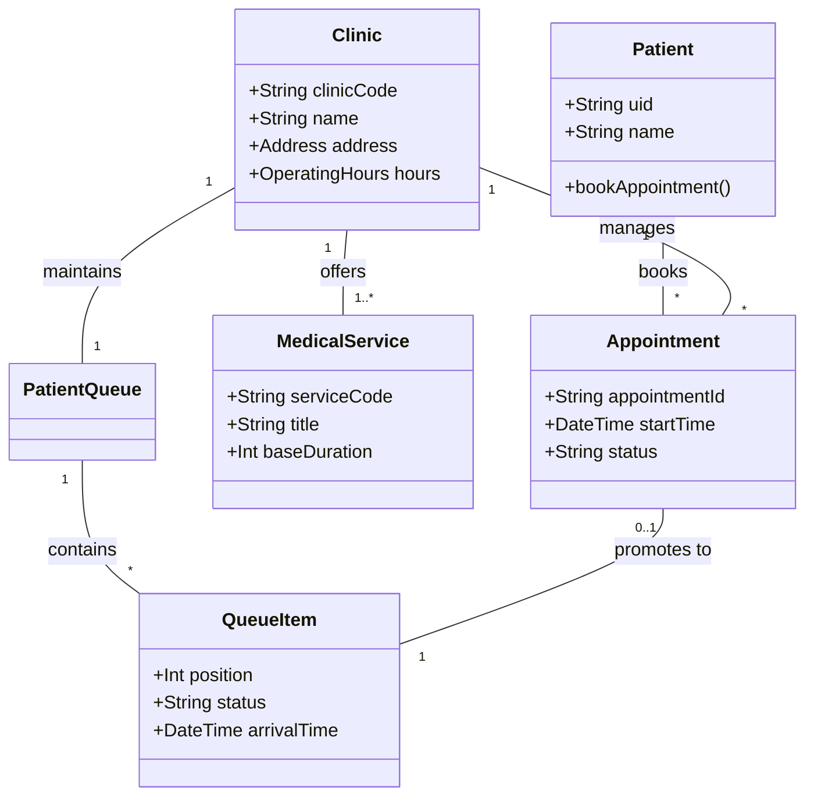
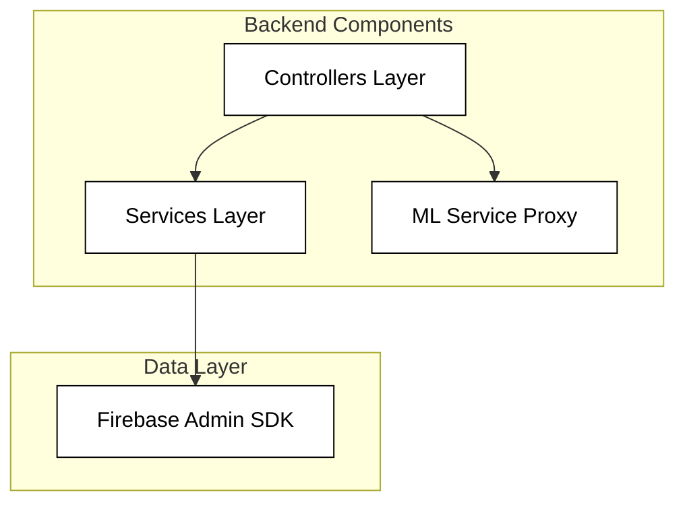
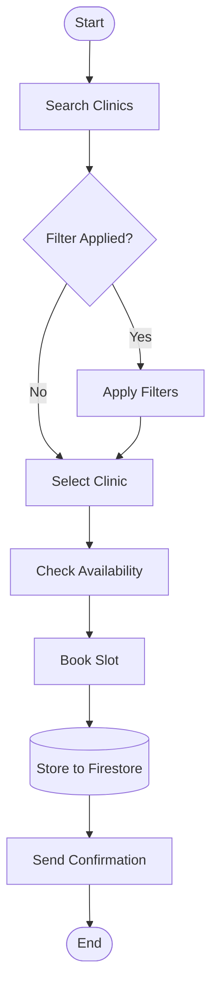

# SmartClinic 4+1 Architectural View Model

## 1. Logical View
Captures the object-oriented design and the core system entities.

### Class Diagram: Multi-Clinic Management System


## 2. Development View
Describes the internal decomposition of components.

### Component Diagram: System Infrastructure


## 3. Physical View
The multi-cloud production topology featuring Azure, Render, and GCP.

### Deployment Diagram: Production Topology
```mermaid
graph TD
    classDef nodeStyle fill:#fff,stroke:#000,stroke-width:2px,color:#000;
    classDef envStyle fill:#fff,stroke:#000,stroke-width:1px,color:#000,stroke-dasharray: 4;
    classDef artStyle fill:#fff,stroke:#000,stroke-width:1px,color:#000;

    subgraph Client ["<<device>> Client PC"]
        subgraph Browser ["<<Execution Environment>> Web Browser"]
            Frontend["<<artifact>> Frontend Web App"]:::artStyle
        end:::envStyle
    end:::nodeStyle

    subgraph Azure ["<<device>> Microsoft Azure"]
        subgraph NodeJs ["<<Execution Environment>> Node.js"]
            subgraph Server ["<<Executable environment>> HTTP Server"]
                Backend["<<artifact>> Backend API Code"]:::artStyle
            end:::envStyle
        end:::envStyle
    end:::nodeStyle

    subgraph Render ["<<device>> Render"]
        subgraph Python ["<<Execution Environment>> Python 3 (Flask)"]
            ML["<<artifact>> ML Service (Wait-time Predictor)"]:::artStyle
        end:::envStyle
    end:::nodeStyle

    subgraph GCP ["<<device>> Google Cloud"]
        subgraph Firebase ["<<Execution Environment>> Firebase Engine"]
            Store["<<artifact>> Firestore Collection"]:::artStyle
        end:::envStyle
    end:::nodeStyle

    Browser -- "HTTP Request (3000)" --> Server
    Server -- "HTTP Request (443)" --> Python
    Backend -- "Firebase SDK" --> Store
    ML -- "Admin SDK" --> Store

    class Client,Azure,Render,GCP nodeStyle;
```

## 4. Process View
Describes the communication and data flow between components.

### Activity Diagram: Appointment Workflow


## 5. Scenario View
Use cases that demonstrate the architectural fitness.

### Use Case: Patient Booking Flow
```mermaid
graph LR
    Patient((Patient)) --> Book[Book Appointment]
    Patient --> Check[Check Wait Times]
    Admin((Clinic Admin)) --> Manage[Manage Services]
    Staff((Medical Staff)) --> Triage[Triage Queue]
    Book -.-> Triage : triggers
```

---
*Maintained by the SmartClinic Architecture Team.*
