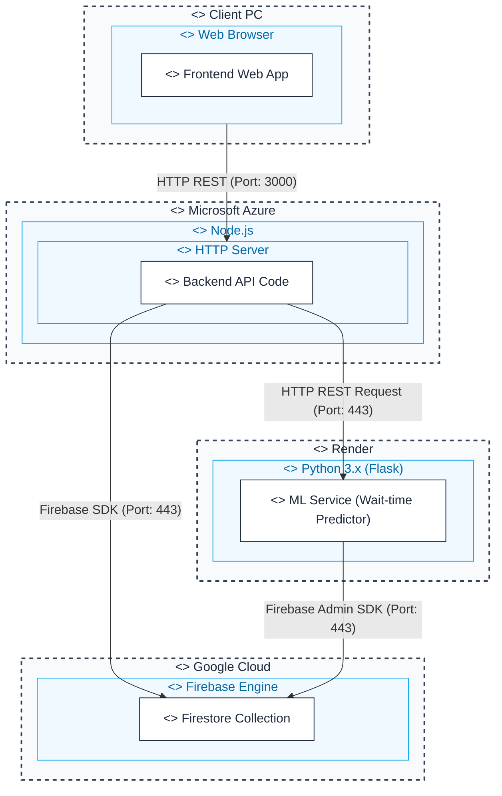

# System Deployment Topology

This document describes the production-grade deployment environment for SmartClinic, utilizing a multi-cloud strategy to leverage the specific pricing and performance strengths of different providers.

## Deployment Diagram

## Infrastructure Overview

### 1. Microsoft Azure (Node.js Backend)
- **Service**: Azure App Service / Containers.
- **Role**: Serves the main Express API and hosts the static Frontend assets (provided via the `public/` directory).
- **Endpoint**: `https://smartclinic-api.azurewebsites.net` (Example).

### 2. Render.com (Python ML Service)
- **Service**: Render Web Service.
- **Role**: Self-contained Flask microservice responsible for training and serving GradientBoostingRegressor models for wait-time predictions.
- **Endpoint**: `https://smartclinic-ml.onrender.com`.

### 3. Google Cloud (Data & Auth)
- **Service**: Firebase (Firestore, Authentication, Hosting).
- **Role**: Centralized NoSQL data storage and user management. Both Azure and Render nodes sync directly with Firestore to ensure data consistency.

---
*Created for SmartClinic Architecture Documentation.*
