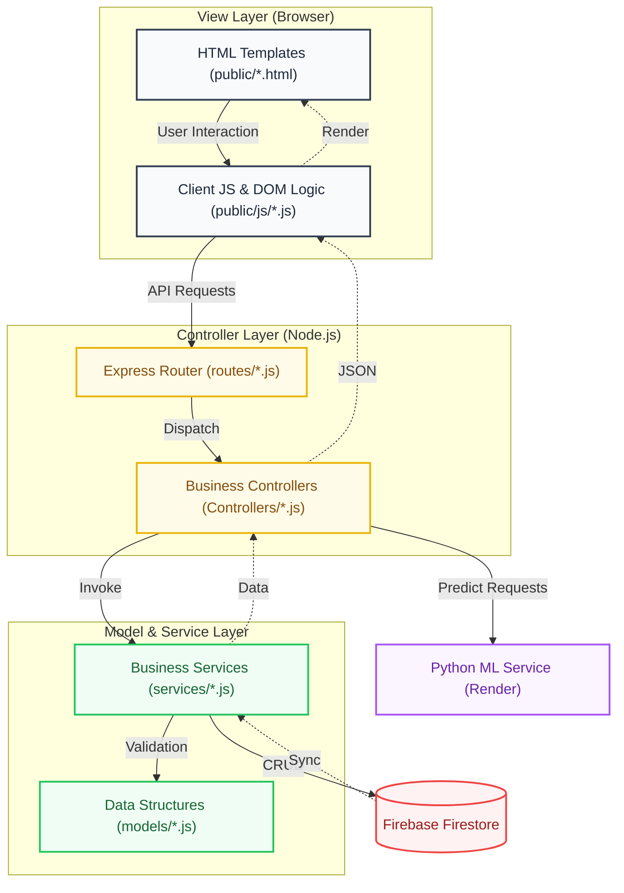

# MVC + Services Architectural Design

SmartClinic utilizes a modular **Model-View-Controller + Services (MVC+S)** localized architecture. This design pattern ensures a strict separation of concerns, making the system easier to test, maintain, and scale across multiple cloud providers.

## Architecture Diagram

## Component Breakdown

### 1. View Layer (`public/`)
Responsible for the "Glassmorphic" UI and user interactions.
- **Templates**: Standard HTML5 semantic files.
- **Client Logic**: Handles `fetch()` API calls to the backend and updates the DOM dynamically.

### 2. Controller Layer (`Controllers/` & `routes/`)
Acts as the entry point for all system requests.
- **Routes**: Defines the API endpoints and maps them to specific controller functions.
- **Controllers**: Orchestrates the flow of data. It parses request parameters and calls the appropriate service.

### 3. Service Layer (`services/`)
The "Brain" of the application. All core business logic resides here to ensure it can be reused across different controllers or even CLI tools.
- **clinicService.js**: Handles clinic metadata and hours logic.
- **appointmentService.js**: Manages booking windows and slot allocations.
- **queueService.js**: Triage and live status management.

### 4. Model Layer (`models/`)
Defines the schema and structure of the data objects used within the code and stored in the database.

---
*Created for SmartClinic Architecture Documentation.*
